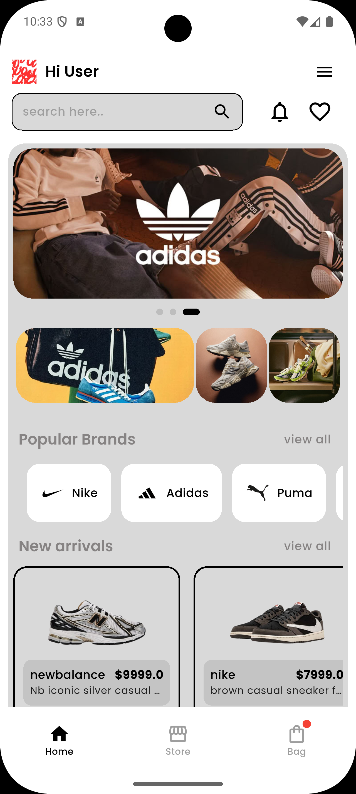
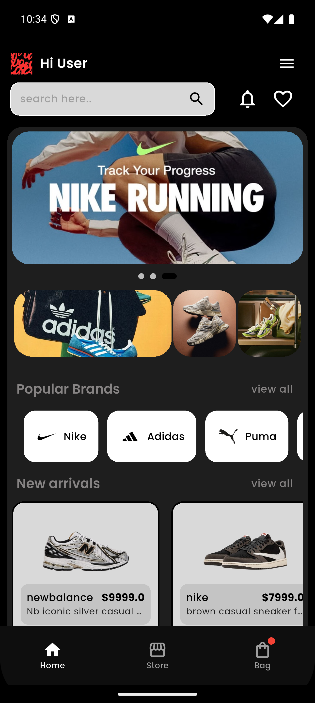
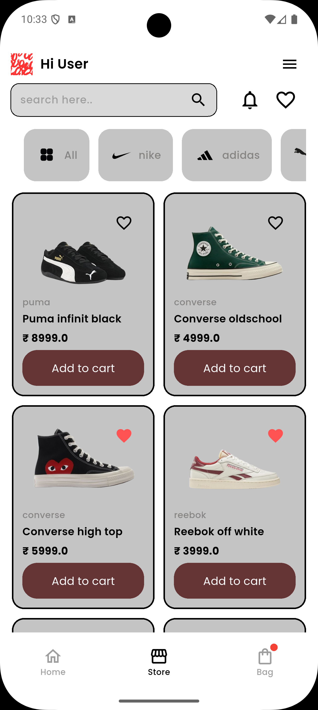
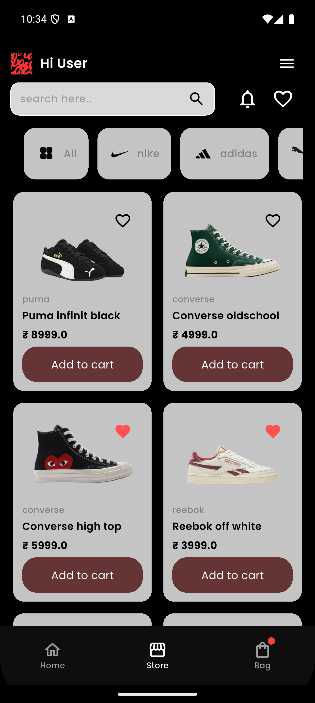
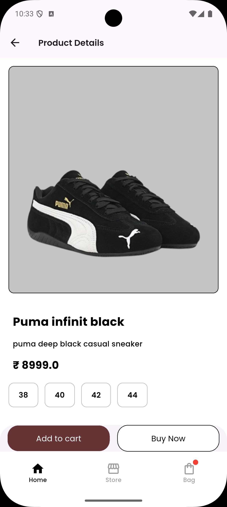
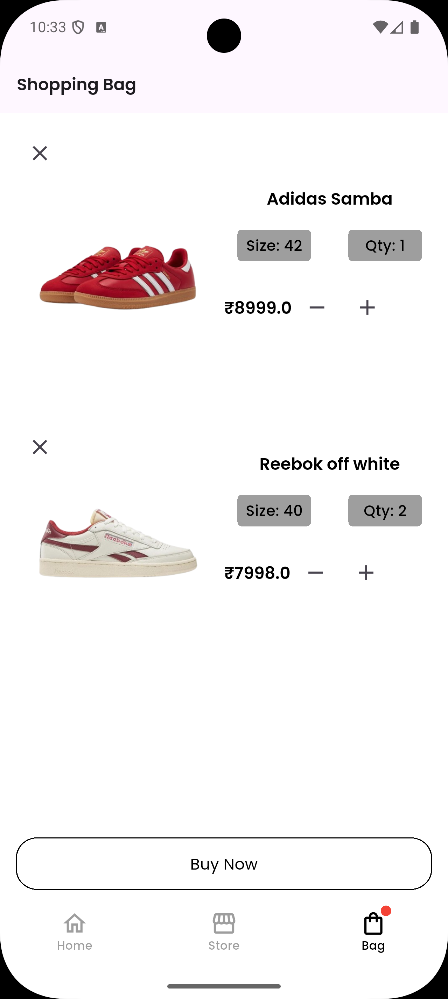
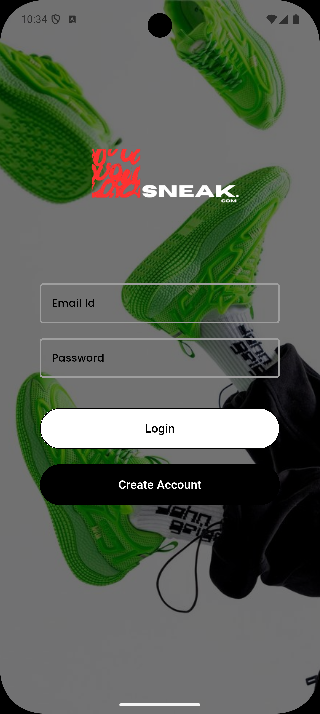

# 👟 SneakCom

# 👟 SneakCom


SneakCom is a modern Flutter-based sneaker e-commerce application built with scalable architecture and Firebase backend.  
It provides a smooth shopping experience with authentication, cart management, wishlist, and real-time Firestore updates.

---

## 🚀 Overview

SneakCom is designed to demonstrate:

- Clean architecture principles
- Scalable Firestore database structure
- Riverpod state management
- GoRouter navigation
- Production-ready authentication flow

This project showcases real-world e-commerce logic including user-specific cart & wishlist handling.

---

## ✨ Features

### 🔐 Authentication
- Firebase Email & Password Login
- Secure Session Handling
- Auth-based Route Guards (GoRouter)

### 🛍 Products
- Grid-based Product Listing
- Product Detail Screen
- Real-time Firestore fetching
- Product Specifications & Sizes

### 🛒 Cart (User-Specific)
- Add to Cart
- Quantity Update
- Remove Item
- Firestore subcollection per user

### ❤️ Wishlist
- Save products
- User-specific storage
- Toggle functionality

### 📦 Order Structure (Ready for Expansion)
- Structured Firestore order schema
- Checkout flow foundation

---

## 🏗 Architecture

SneakCom follows 

## 🏗 Architecture

```
lib/
│
├── common/
│   ├── buttons/
│   ├── icons/
│   ├── reusable_widgets/
│   └── styles/
│
├── features/
│   ├── account/
│   ├── address_and_phone/
│   ├── authentication/
│   ├── bag/
│   ├── buynow/
│   ├── home/
│   ├── onboarding/
│   ├── payment_screen/
│   ├── product_detailed/
│   ├── store/
│   └── wishlist/
│
├── navigators/
│   ├── bottomNAVbar/
│   └── routers/
│
├── util/
│   ├── constants/
│   ├── helpers/
│   ├── theme/
│   └── validators/
│
├── app.dart
├── firebase_options.dart
└── main.dart

ios/
linux/
macos/
test/
web/
windows/

README.md
```

### Layers:

- **Core** → models + provider + services  
- **UI** → screens + widgets

---

## 🧠 State Management

SneakCom uses **Riverpod** for scalable state handling.

🔥 Backend (Firebase)
Services Used:

Firebase Authentication

Cloud Firestore

Firebase Storage

Firestore Structure

users/
   userId/
      cart/
      wishlist/
      orders/

products/
   productId/

Each user has their own subcollections:

cart

wishlist

orders  

🧑‍💻 Tech Stack

| Technology         | Role             |
| ------------------ | ---------------- |
| Flutter            | UI Framework     |
| Riverpod           | State Management |
| Firebase Auth      | Authentication   |
| Cloud Firestore    | Database         |
| Firebase Storage   | Image Storage    |
| GoRouter           | Navigation       |
| Freezed (optional) | Model Generation |
| Dio (optional)     | API Handling     |

⚙️ Getting Started
1️⃣ Clone Repository
git clone https://github.com/ebinantony95/e-commerce-App-flutter-riverpod.git 

2️⃣ Install Dependencies
flutter pub get

3️⃣ Setup Firebase

Create a Firebase Project

Enable:

Authentication (Email/Password)

Firestore Database

Storage

Download:

google-services.json → android/app

GoogleService-Info.plist → ios/Runner

Run: flutterfire configure

4️⃣ Run App: flutter run


🛡 Route Protection (GoRouter)

SneakCom uses auth-based redirection:

Logged Out → Login Screen

Logged In → Home Screen

🎯 Future Improvements


Payment Gateway Integration (Stripe/Razorpay)

Admin Panel

Product Reviews

Order Tracking

Push Notifications

Dark Mode

API-based product auto-fetch

📈 Why This Project Matters

SneakCom demonstrates:

✔ Real-world Firestore structure
✔ Proper user-specific database handling
✔ Scalable state management
✔ Production-ready routing logic
✔ Clean folder structure

This is my vary first app that im using riverpod, so it need some improvements

## 📸 App Screenshots

| Home Light | Home Dark |
|-------------|------------|
|  |  |

| Store Light | Store Dark |
|-------------|------------|
|  |  |

| Product Details | Cart |
|----------------|------|
|  |  |

| Login | Create Account |
|------|---------------|
|  |  |

